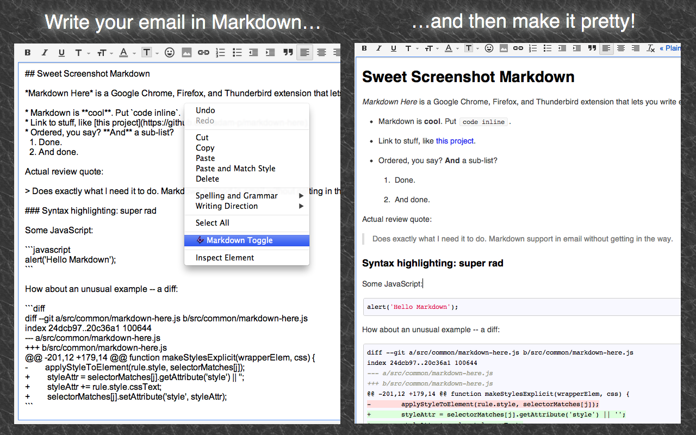

# Zaujímavé JavaScript aplikácie
## Markdown Here 

### Charakteristika
Markdown Here je plugin do prehliadača Google Chrome, využíva Chrome knižnicu na tvorbu pluginov. Je to rozšírenie, vďaka ktorému je možné písať emaily pomocou značkovacieho jazyka Markdown. Text je renderovaný pred odoslaním a po renderovaní je vždy možný návrat späť do podoby Markdownu. Užitočný nástroj na jednoduché formátovanie emailov, hlavne ak je používateľ zvyknutý na Markdown značky. 

Rozšírenie je možné využiť pri písaní mailov z akéhokoľvek webového mailového klienta. Ovládanie pluginu je jednoduché pomocou kontextového menu priamo v textovom poli vytváraného mailu. 

### Ukážka


### Zdroje
Zdrojový kód:
https://github.com/adam-p/markdown-here 

Návod na vytváranie rozšírení pre Google Chrome:
https://thoughtbot.com/blog/how-to-make-a-chrome-extension


## Polacode - Polaroid for your code

### Charakteristika
Nástroj na formátovanie kopírovaného kódu - pri vytváraní screenshotov kódu je vhodné mať možnosť kód ešte pred tým naformátovať, umožňuje tiež vybrať si tému, v ktorej sa kód bude dormátovať - skúšať rôzne farebné kombinácie a fonty. Polacode je písaný v JavaScripte s použitím YO nástroja na vytváranie pluginov do Visual Studio Code editora, využíva vscode knižnicu na prácu s Visual Studio Code. 

### Ukážka


Príklad: zaregistruje do Visual Studio Code prikaz ` polacode.activate `, ktorý zobrazí "viewport" pre prácu s polacode. 
```javascript
      vscode.commands.registerCommand('polacode.activate', () => {
	    panel = vscode.window.createWebviewPanel('polacode', P_TITLE, 2, {
	      enableScripts: true,
	      localResourceRoots: [vscode.Uri.file(path.join(context.extensionPath, 'webview'))]
	    })
	

	    panel.webview.html = getHtmlContent(htmlPath)
	

	    const selectionListener = setupSelectionSync()
	    panel.onDidDispose(() => {
	      selectionListener.dispose()
	    })
	

	    setupMessageListeners()
	

	    const fontFamily = vscode.workspace.getConfiguration('editor').fontFamily
	    const bgColor = context.globalState.get('polacode.bgColor', '#2e3440')
	    panel.webview.postMessage({
	      type: 'init',
	      fontFamily,
	      bgColor
	    })
	

	    syncSettings()
	  })
```

### Zdroje
Zdrojový kód:
https://github.com/octref/polacode

Návod na vytváranie rozšírení pre Visual Studio Code:
https://scotch.io/tutorials/create-your-first-visual-studio-code-extension


## Full Page Screen Capture

### Charakteristika
Plugin do prehliadača Google Chrome napísaný v JavaScripte. Umožňuje spraviť screenshot celej stránky, na ktorej sa práve nachádzame a uložiť si ho v rôznych formátoch, takže môže byť neskôr využitý napr. v dokumentáciách projektov. 

### Ukážka


### Zdroje
Zdrojový kód:
https://github.com/mrcoles/full-page-screen-capture-chrome-extension

Odkaz na stiahnutie:
https://chrome.google.com/webstore/detail/full-page-screen-capture/fdpohaocaechififmbbbbbknoalclacl?hl=sk


    
    
