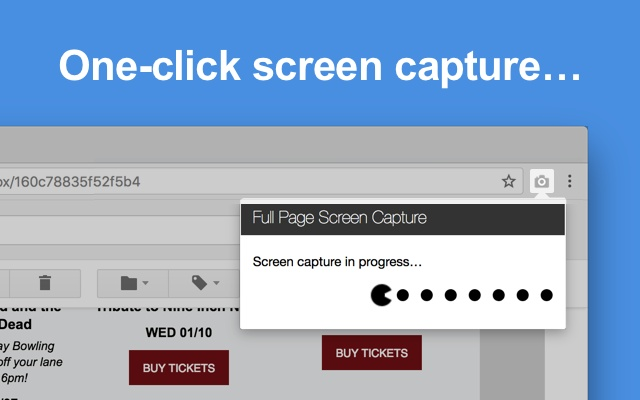
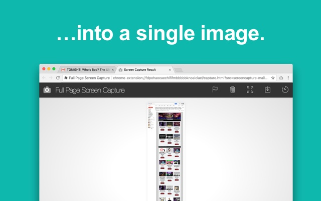

# Zaujímavé JavaScript aplikácie
## Node - ytdl 

### Charakteristika
Node ytdl je CLI aplikácia na štahovanie videí z YouTube priamo z príkazového riadku. 

### Ukážka
Uloženie videa do súboru: 
```javascript
ytdl "http://www.youtube.com/watch?v=_HSylqgVYQI" > myvideo.mp4
```

Stiahnutie videa a uloženie vo formáte mp3:
```javascript
ytdl http://www.youtube.com/watch?v=_HSylqgVYQI | ffmpeg -i pipe:0 -b:a 192K -vn myfile.mp3
``` 

### Zdroje
Zdrojový kód:
https://www.npmjs.com/package/ytdl?fbclid=IwAR1FMlUATnUIddYCo7ClQZhhuWQK5rAyDft4pZB-WRq-ozoe_4hFYyH6Ovc 


## Polacode - Polaroid for your code

### Charakteristika
Nástroj na formátovanie kopírovaného kódu - pri vytváraní screenshotov kódu je vhodné mať možnosť kód ešte pred tým naformátovať, umožňuje tiež vybrať si tému, v ktorej sa kód bude dormátovať - skúšať rôzne farebné kombinácie a fonty. Polacode je písaný v JavaScripte s použitím YO nástroja na vytváranie pluginov do Visual Studio Code editora, využíva vscode knižnicu na prácu s Visual Studio Code. 

### Ukážka


Príklad: zaregistruje do Visual Studio Code prikaz ` polacode.activate `, ktorý zobrazí "viewport" pre prácu s polacode. 
```javascript
vscode.commands.registerCommand('polacode.activate', () => {
    panel = vscode.window.createWebviewPanel('polacode', P_TITLE, 2, {
      enableScripts: true,
      localResourceRoots: [vscode.Uri.file(path.join(context.extensionPath, 'webview'))]
    })


    panel.webview.html = getHtmlContent(htmlPath)


    const selectionListener = setupSelectionSync()
    panel.onDidDispose(() => {
      selectionListener.dispose()
    })


    setupMessageListeners()


    const fontFamily = vscode.workspace.getConfiguration('editor').fontFamily
    const bgColor = context.globalState.get('polacode.bgColor', '#2e3440')
    panel.webview.postMessage({
      type: 'init',
      fontFamily,
      bgColor
    })


    syncSettings()
  })
```

### Zdroje
Zdrojový kód:
https://github.com/octref/polacode

Návod na vytváranie rozšírení pre Visual Studio Code:
https://scotch.io/tutorials/create-your-first-visual-studio-code-extension


## Full Page Screen Capture

### Charakteristika
Plugin do prehliadača Google Chrome napísaný v JavaScripte. Umožňuje spraviť screenshot celej stránky, na ktorej sa práve nachádzame a uložiť si ho v rôznych formátoch, takže môže byť neskôr využitý napr. v dokumentáciách projektov. 

### Ukážka



### Zdroje
Zdrojový kód:
https://github.com/mrcoles/full-page-screen-capture-chrome-extension

Odkaz na stiahnutie:
https://chrome.google.com/webstore/detail/full-page-screen-capture/fdpohaocaechififmbbbbbknoalclacl?hl=sk


    
    
